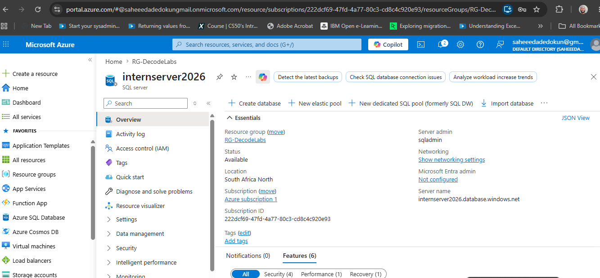
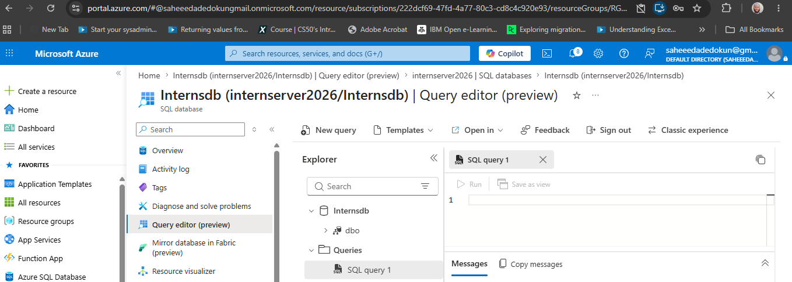
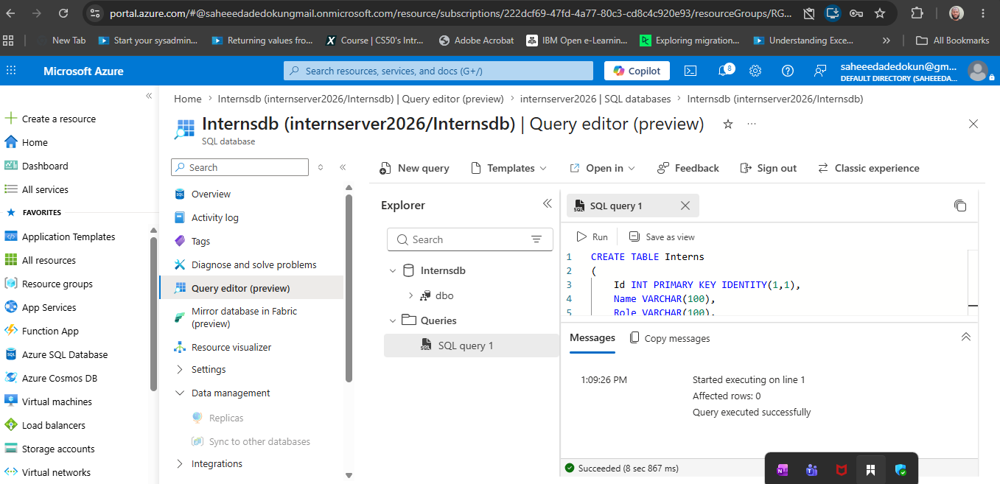
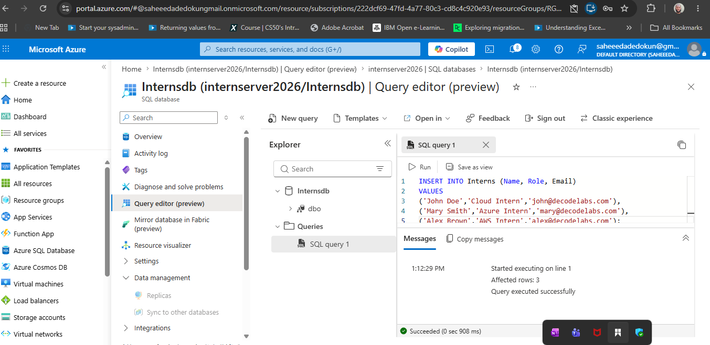
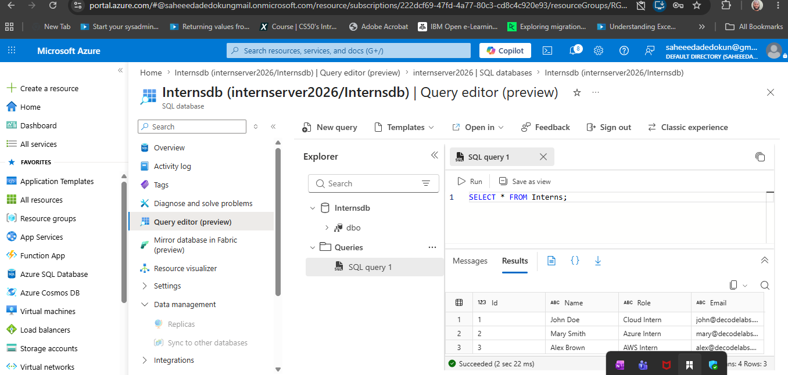
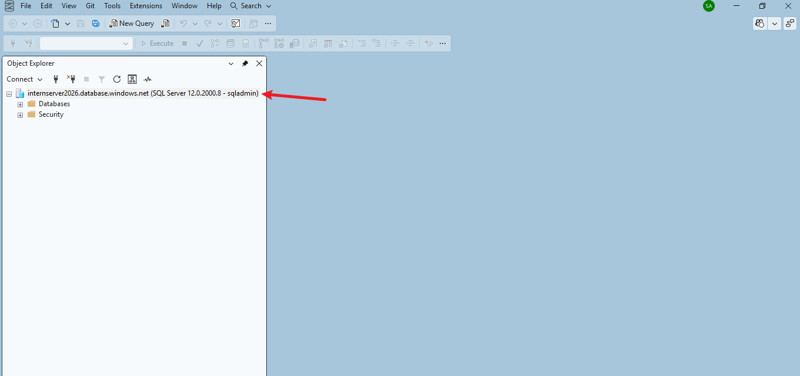
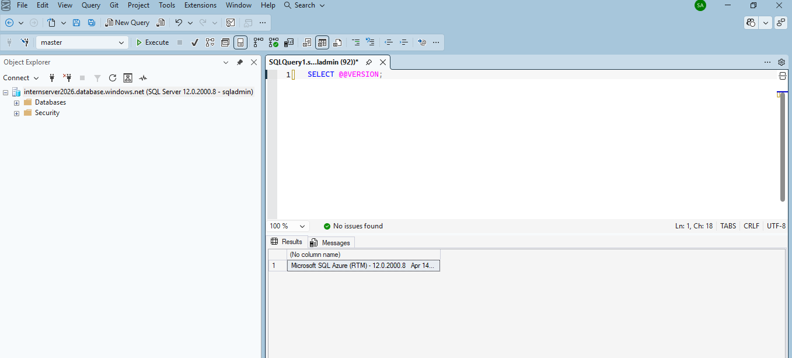
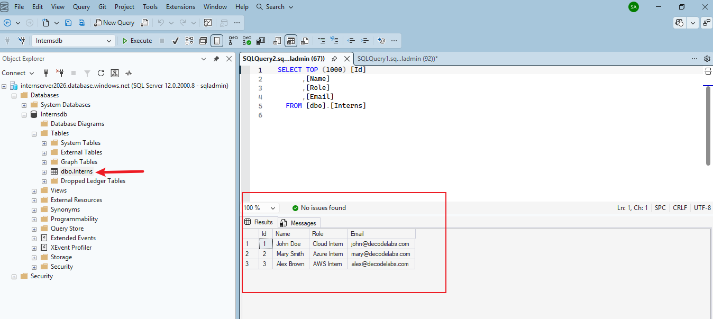

# Task-3-Saheed

## The provision of a managed cloud database, create a table named Interns with columns for Name, Role, Email, and insert sample records to verify data persistence. Use a Relational Database Service (RDS), (MySQL) in Azure Website Portal.


### 1. **Create a MySQL Database in Azure:**
   - Log in to the Azure Portal.
   - Click on "Create a resource" and search for "MySQL Database".
   - Select "Azure Database for MySQL" and click "Create".
   - Fill in the required details such as subscription, resource group, server name, location, and admin credentials.
   - Choose the pricing tier and click "Review + create" and then "Create". 





### 2. I opened the query editor to begin creating the table and inserting records.




### 3. **Create the Interns Table Command:**
   - In the query editor, execute the following SQL command to create the `Interns` table:

```sql
CREATE TABLE Interns 
(
    Name VARCHAR(100),
    Role VARCHAR(100),
    Email VARCHAR(100)
);




### 4. **Insert data into the Interns Table;**
   - Execute the following SQL command to insert data records into the `Interns` table:

```sql
INSERT INTO Interns (Name, Role, Email) VALUES 
('John Doe', 'cloud Intern', 'john@decodelabs.com'),
('Jane Smith', 'Azure Intern', 'mary@decodelabs.com'),
('Bob Johnson', 'AWS Intern', 'alex@decodelabs.com');
```



### 5. **Verify Data Persistence:**
   - To verify that the data has been inserted correctly, execute the following SQL command to retrieve all records from the `Interns` table:

```sql
SELECT * FROM Interns;
```



### 6. **Connected using the connection string provided in the Azure portal, I was able to verify that the data is persistent and can be accessed from both the Azure portal and a local SQL client.**




### 7. **Data Persistence Verification in Local SQL Client:**
   - The records inserted into the `Interns` table were successfully retrieved, confirming that the data is persistent in the Azure MySQL database.

   

   


### 8. **Conclusion:**
   - The MySQL database was successfully created in Azure, the `Interns` table was created, and sample records were inserted and verified for data persistence. This demonstrates the ability to manage a cloud database using Azure's Relational Database Service (RDS).

